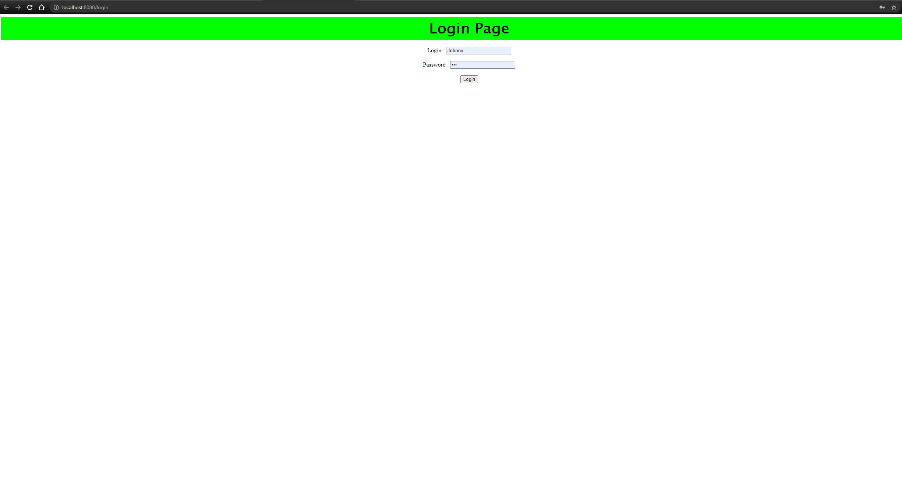
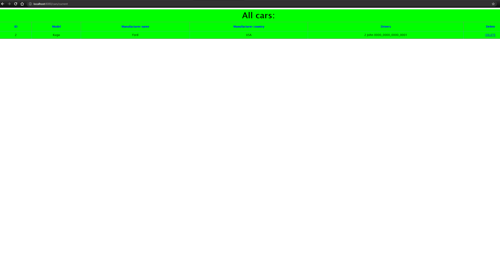

# **TAXI SERVICE**
Simple website. where you can make connection taxi drivers with cars.

## _FUNCTIONS :_

1. Create new manufacturer.
1. Delete manufacturer.(Soft delete)
1. Display all manufacturers.   
1. Create new driver.
1. Delete driver.(Soft delete)
1. Display all drivers.
1. Create new car.
1. Delete car.(Soft delete)
1. Display all cars.
1. Display all car with drivers.
1. Display cars for current driver.
1. Add connections cars to drivers.

## _PROJECT USES :_ 

* Java 11.
* Maven 4.0.0.
* Servlet API 4.0.1.
* JSTL 1.2.
* Log4j 2.14.1.
* Mysql Connector Java 8.0.22. 
* Maven Checkstyle Plugin 3.1.1.
* Tomcat 9.0.50.
* MySQL Workbench 8.0.25.

## _DATABASE STRUCTURE :_

 

## _HOW TO RUN PROJECT :_

1. Create new maven project in your IDE.
1. Add SDK(11 or above).
1. Configure Tomcat(9.0.50 or above).
1. Install MySQL.
1. Install MySQL Workbench(8.0.25 or above). 
1. Change your parameters (Example below) 
1. Configure Tomcat (Local).
1. Change path to your absolute path in log4j2.xml 

